<div align="center">

# odo

**Visitor counter badges for your GitHub profile and website.**

Flat pills, retro digit styles, or dragons, robots and aliens holding up your numbers — counted atomically on Cloudflare's edge and free to host.

<br>

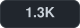 &nbsp;
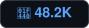 &nbsp;
 &nbsp;
 &nbsp;


<br><br>

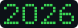 &nbsp;
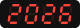 &nbsp;
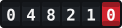 &nbsp;
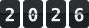

<br><br>


<br><br>

[](LICENSE)
[](https://workers.cloudflare.com)
[](tsconfig.json)

**[Open Odo →](https://odo.umt0x.workers.dev)** · [Visitor counter builder](https://odo.umt0x.workers.dev/counter) · [Spotify card builder](https://odo.umt0x.workers.dev/now-playing)

[Usage](#usage) · [Options](#options) · [Themes](#themes) · [Spotify](#spotify-now-playing) · [Self-hosting](#self-hosting) · [Development](#development)

<sub>This README has been viewed</sub><br>
<a href="https://odo.umt0x.workers.dev"></a>

</div>

---

## Why odo

- **One line to add.** Paste a Markdown image into your README and you're done.
- **Accurate.** Every handle gets its own Durable Object, so simultaneous visits are never lost.
- **Eight looks.** A minimal flat pill, four recolorable digit styles drawn in code — pixel, LED, odometer and flip — and three original character sets: baby dragons, robots and aliens.
- **Builders included.** Design your badge or Spotify card on the site and see it in a GitHub-style preview, light or dark.
- **18 languages.** The site follows your browser's language, with a picker in the footer.
- **Spotify card.** Show what you're listening to right now, with cover art and a live progress bar.
- **Safe to embed.** Every input is validated, and badges are served with a strict Content-Security-Policy.
- **Free.** The Workers Free plan covers roughly 100k badge views a day.

## Usage

Add this to your README — replace `your-name` with any handle you like:

```markdown

```

Every time the image loads, the count for `@your-name` goes up by one. Handles are case-insensitive (`@Umt0x` and `@umt0x` share a counter) and may use up to 39 letters, digits, `-` and `_`.

Prefer to click instead of type? Use [the builder](https://odo.umt0x.workers.dev/counter): pick a style, check the preview and copy the snippet. Want your own instance? See [Self-hosting](#self-hosting).

## Options

Add options as query parameters, e.g. `/@your-name?icon=👀&bg=0d1117&color=58a6ff`.

### Every style

| Option | Description | Default |
| :--- | :--- | :--- |
| `theme` | `flat`, or a [theme](#themes) id | `flat` |
| `scale` | Display size multiplier, `0.1` – `10` | `1` |
| `num` | Show this number instead of counting (whole number ≥ 0) | — |
| `render` | `true` shows the current count without adding a visit | — |

### Flat

| Option | Description | Default |
| :--- | :--- | :--- |
| `icon` | Up to two characters in front of the number — emoji welcome | — |
| `bg` | Fill color: hex without `#`, or a CSS color name | `21262d` |
| `color` | Text color | `c9d1d9` |
| `stroke` | Border color | `30363d` |
| `animation` | Entrance animation: `fade`, `slide`, `pulse` or `none` | `none` |

Large numbers are shortened automatically: `1337` → `1.3K`, `1250000` → `1.3M`.

### Digit themes

| Option | Description | Default |
| :--- | :--- | :--- |
| `length` | Minimum number of digits, `1` – `16`; shorter counts are padded with zeros | `7` |
| `color` | Digit color — drawn themes only | per theme |
| `bg` | Background color, or `transparent` — drawn themes only | per theme |
| `pixelated` | `0` turns off crisp scaling — character themes only | on |

## Themes

The list is also available as JSON at `/themes`.

### Drawn

Drawn in code: they stay sharp at any size and take any colors via `color` and `bg`.

| Theme | `theme=` | Preview |
| :--- | :--- | :--- |
| Pixel | `pixel` |  &nbsp; 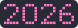 |
| LED | `led` |  &nbsp; 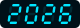 |
| Odometer | `odometer` |  |
| Flip | `flip` |  |

```markdown

```

### Characters

Original pixel-art sets by Umt0x: every digit is its own character holding up its number.

| Theme | `theme=` | Digits 0–9 |
| :--- | :--- | :--- |
| Umt0x: The First Ten | `first-ten` |  |
| Umt0x: First Boot | `first-boot` |  |
| Umt0x: Aliens | `aliens` | 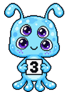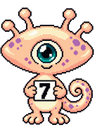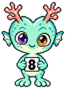 |

```markdown

```

## Spotify now playing

A card with the song you're playing on Spotify right now — or the last one you played — with its cover art and a progress bar that keeps moving.

```markdown
[](https://odo.umt0x.workers.dev/spotify/open)
```

Design it on [the Spotify card builder](https://odo.umt0x.workers.dev/now-playing), or set the options yourself:

| Option | Description | Default |
| :--- | :--- | :--- |
| `style` | One of the [card styles](#card-styles) below | `card` |
| `mascot` | Character for the `mascot` style: `dragon`, `robot` or `alien`, optionally numbered like `dragon-3` | `dragon` |
| `mode` | `dark` or `light` | `dark` |
| `bg`, `color`, `accent` | Background, text and accent colors (hex without `#` or a CSS color name) | per mode, accent `1db954` |
| `cover` | `0` hides the cover art | shown |
| `progress` | `0` hides the progress bar | shown |
| `scale` | Display size multiplier, `0.1` – `10` | `1` |

`/spotify/open` takes visitors straight to the song on the card.

#### Card styles

| `style=` | What it looks like |
| :--- | :--- |
| `card` | Cover, status, title, artist and a moving progress bar |
| `compact` | One slim line: title · artist |
| `vinyl` | A record that spins while the song plays, with the cover as its label |
| `cassette` | A tape whose reels turn and wind as the song progresses |
| `blur` | The cover, blurred, becomes the background — every song brings its own colors |
| `terminal` | A shell window printing the song, with a blinking cursor |
| `lcd` | A green pixel LCD; long titles scroll like a car stereo |
| `polaroid` | A tilted instant photo of the cover with a handwritten caption (tall) |
| `badge` | A two-part badge, `Spotify │ Title — Artist`, to sit next to other badges |
| `equalizer` | Bars bounce across the card behind the song |
| `mascot` | An Umt0x character next to a speech bubble with the song; notes float up |
| `island` | A floating pill like a phone's dynamic island, with a live waveform |
| `player` | Big cover, title block and a scrubber with elapsed and total time |

Each Odo deployment shows **one** Spotify account: its owner's. Spotify only lets new apps sign in up to 25 hand-picked users, so the card is built for your own profile rather than as a shared service.

### Connecting your account

1. Create an app at [developer.spotify.com/dashboard](https://developer.spotify.com/dashboard) with the redirect URI `https://<your-worker>/spotify/callback` and the Web API enabled.
2. Put its client ID in `wrangler.toml` (`SPOTIFY_CLIENT_ID`) and deploy.
3. Store the client secret: `npx wrangler secret put SPOTIFY_CLIENT_SECRET`.
4. Open `https://<your-worker>/spotify/login` and sign in. After that, only the same Spotify account can reconnect.

## Self-hosting

odo runs on your own Cloudflare account. You need [Node.js](https://nodejs.org) 18+ and a free [Cloudflare](https://dash.cloudflare.com/sign-up) account.

```bash
# 1. Install dependencies
npm install

# 2. Sign in to Cloudflare
npx wrangler login

# 3. Deploy
npm run deploy
```

Wrangler prints your URL when the deploy finishes. The visit counter needs no setup: its Durable Object is created on the first deploy.

## Development

```bash
npm run dev              # builder at http://localhost:8787
npm test                 # run the test suite
npm run typecheck        # type-check with tsc
```

### How it works

```
GET /@umt0x?theme=led
   │
   ├─ badge/options.ts      validate the handle and every option
   ├─ counter/              add a visit in the handle's Durable Object (skipped for render=true or num=)
   ├─ badge/flat.ts         draw the flat pill, or
   │  badge/glyph.ts        draw pixel / LED / odometer / flip digits, or
   │  badge/sprite.ts       lay out character images bundled with the worker
   └─ routes/badge.ts       return the SVG with no-store and CSP headers
```

### Project structure

```
src/
├── index.ts             Worker entry: exports the app and the Durable Object
├── app.ts               Route table
├── env.ts               Cloudflare bindings
├── routes/              Route handlers: badges, Spotify, pages (with language selection)
├── badge/               Option parsing and the flat, drawn and sprite renderers
├── counter/             VisitCounter Durable Object and its client
├── spotify/             Spotify API client, account Durable Object and card
├── themes/catalog.ts    Every theme: ids, labels, colors and image sets
├── ui/                  Landing page, builders, shared layout, styles and browser scripts
├── i18n/                UI strings: en.ts is the source, locales/ has the translations
├── lib/                 Escaping and other text helpers
└── assets/              Character images (bundled into the worker)
test/                    Vitest suites
```

### Adding a language

Copy `src/i18n/locales/tr.ts`, translate the strings and add the language to `LOCALES` in `src/i18n/index.ts`. `npm test` checks that every string is translated.

### Adding a theme

- **Drawn:** add a drawing function to `src/badge/glyph.ts`, register it in `DRAWERS` and in `src/themes/catalog.ts` with a label and default colors.
- **Characters:** put `0.png` … `9.png` in a folder under `src/assets/` with an `index.ts` like the existing ones, and register the set in `src/themes/catalog.ts`. Keep each image small (around 10 KB): every digit is embedded in the badge.

`npm test` checks that every theme renders and that image cell sizes match the files.

## License

[MIT](LICENSE) © 2026 Umt
