<div align="center">

# odo

**Visitor counter badges for your GitHub profile and website.**

Clean flat pills or pixel-art sprites, counted atomically on Cloudflare's edge — and free to host.

<br>

 &nbsp;
 &nbsp;
 &nbsp;
 &nbsp;


<br><br>


<br><br>

[](LICENSE)
[](https://workers.cloudflare.com)
[](tsconfig.json)

[Usage](#usage) · [Options](#options) · [Sprite themes](#sprite-themes) · [Self-hosting](#self-hosting) · [Development](#development)

</div>

---

## Why odo

- **One line to add.** Paste a Markdown image into your README and you're done.
- **Accurate.** Every handle gets its own Durable Object, so simultaneous visits are never lost.
- **Two looks.** A minimal flat pill you can recolor, or a row of pixel-art digits.
- **Builder included.** Open the worker in a browser to design your badge with a live preview.
- **Safe to embed.** Every input is validated, and badges are served with a strict Content-Security-Policy.
- **Free.** The Workers Free plan covers roughly 100k badge views a day.

## Usage

Once [deployed](#self-hosting), add this to your README — replace `your-name` with any handle you like:

```markdown

```

Every time the image loads, the count for `@your-name` goes up by one. Handles are case-insensitive (`@Umt` and `@umt` share a counter) and may use up to 39 letters, digits, `-` and `_`.

Prefer to click instead of type? Open `https://odo.<your-account>.workers.dev` for the builder.

## Options

Add options as query parameters, e.g. `/@your-name?icon=👀&bg=0d1117&color=58a6ff`.

### Every style

| Option | Description | Default |
| :--- | :--- | :--- |
| `theme` | `flat`, or a [sprite theme](#sprite-themes) id | `flat` |
| `scale` | Display size multiplier, `0.1` – `10` | `1` |
| `num` | Show this number instead of counting (whole number ≥ 0) | — |
| `render` | `true` shows the current count without adding a visit | — |

### Flat

| Option | Description | Default |
| :--- | :--- | :--- |
| `icon` | Up to two characters in front of the number — emoji welcome | — |
| `bg` | Fill color: hex without `#`, or a CSS color name | `21262d` |
| `color` | Text color | `c9d1d9` |
| `stroke` | Border color | `30363d` |
| `animation` | Entrance animation: `fade`, `slide`, `pulse` or `none` | `none` |

Large numbers are shortened automatically: `1337` → `1.3K`, `1250000` → `1.3M`.

### Sprites

| Option | Description | Default |
| :--- | :--- | :--- |
| `length` | Minimum number of digits, `1` – `16`; shorter counts are padded with zeros | `7` |
| `pixelated` | `0` turns off crisp pixel-art scaling | on |

## Sprite themes

Use the id as `theme`, for example `/@your-name?theme=naruto&length=5`. The list is also available as JSON at `/themes`.

| Theme | `theme=` | Preview |
| :--- | :--- | :--- |
| Naruto | `naruto` |  |
| One Piece | `onepiece` | 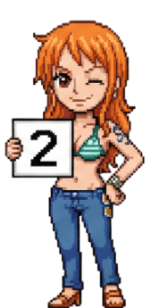 |
| Bleach | `bleach` | 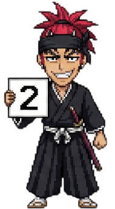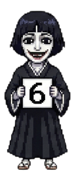 |
| Dragon Ball | `dragonball` | 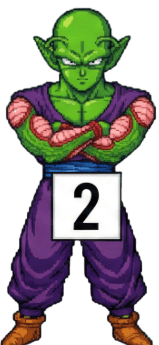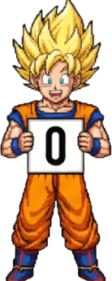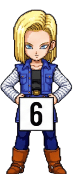 |
| Attack on Titan | `aot` | 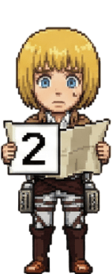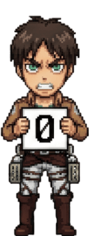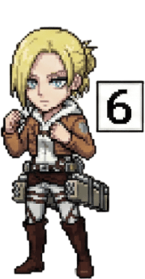 |
| Code Geass | `codegeass` | 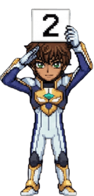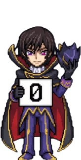 |
| Death Note | `l` |  |
| Monster | `monster` | 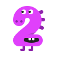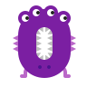 |
| Adventure Time | `adventuretime` | 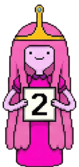 |
| Gumball | `gumball` |  |

## Self-hosting

odo runs on your own Cloudflare account. You need [Node.js](https://nodejs.org) 18+ and a free [Cloudflare](https://dash.cloudflare.com/sign-up) account.

```bash
# 1. Install dependencies
npm install

# 2. Sign in to Cloudflare
npx wrangler login

# 3. Create the bucket for the sprite images and upload them
npx wrangler r2 bucket create odo-sprites
npm run sprites:upload:remote

# 4. Deploy
npm run deploy
```

Wrangler prints your URL when the deploy finishes. The visit counter needs no setup: its Durable Object is created on the first deploy.

## Development

```bash
npm run sprites:upload   # copy the sprites into the local bucket (once)
npm run dev              # builder at http://localhost:8787
npm test                 # run the test suite
npm run typecheck        # type-check with tsc
```

### How it works

```
GET /@umt?theme=naruto
   │
   ├─ badge/options.ts      validate the handle and every option
   ├─ counter/              add a visit in the handle's Durable Object (skipped for render=true or num=)
   ├─ badge/flat.ts         draw the flat pill, or
   │  badge/sprite.ts       lay out digit images loaded from R2 (cached in memory)
   └─ routes/badge.ts       return the SVG with no-store and CSP headers
```

### Project structure

```
src/
├── index.ts             Worker entry: exports the app and the Durable Object
├── app.ts               Route table
├── env.ts               Cloudflare bindings
├── routes/              One handler per route: badge, themes, builder page
├── badge/               Option parsing and the flat / sprite renderers
├── counter/             VisitCounter Durable Object and its client
├── themes/catalog.ts    Sprite themes: ids, labels and cell sizes
├── ui/                  Builder page: markup, styles and browser script
├── lib/                 Escaping and other text helpers
└── assets/              Sprite digit images, uploaded to R2
scripts/
└── upload-sprites.mjs   Uploads src/assets to R2
test/                    Vitest suites
```

### Adding a sprite theme

1. Add `0.png` … `9.png` (or `.gif`) to `src/assets/<id>/`.
2. Register the theme in `src/themes/catalog.ts`. `npm test` tells you if the cell size doesn't match the images.
3. Run `npm run sprites:upload`, and `npm run sprites:upload:remote` before deploying.

## License

[MIT](LICENSE) © 2026 Umt
